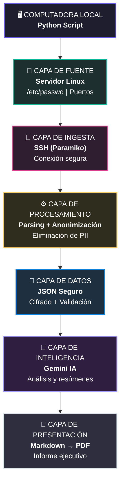

# 🔐 Pipeline de Auditoría de Seguridad con IA
Script automatizado que realiza auditorías de seguridad en servidores Linux mediante SSH, analiza los hallazgos con Gemini 3.5 Flash y genera un reporte profesional en PDF.

---
## Requisitos previos
- Python 3.10 o superior
- Acceso SSH al servidor objetivo con una llave **Ed25519**
- El host del servidor debe estar registrado en tu archivo `known_hosts`
- API Key de [Google Gemini](https://aistudio.google.com/apikey)
---
## Instalación

### 1. Clonar el repositorio
```bash
git clone https://github.com/p175624/Proyecto_IA
cd Proyecto_IA
```

### 2. Crear y activar el entorno virtual

Se recomienda usar un entorno virtual para aislar las dependencias del proyecto.

```bash
# Crear el entorno virtual
python3 -m venv venv

# Activar en macOS / Linux
source venv/bin/activate

# Activar en Windows (CMD)
venv\Scripts\activate.bat

# Activar en Windows (PowerShell)
venv\Scripts\Activate.ps1
```

Una vez activado, verás el prefijo `(venv)` en tu terminal:
```
(venv) usuario@equipo:~/pipeline-auditoria$
```

### 3. Instalar las dependencias
```bash
pip install -r requirements.txt
```

> Para desactivar el entorno virtual cuando termines: `deactivate`

---
## Configuración
Crea un archivo `.env` en la raíz del proyecto con las siguientes variables:
```env
GEMINI_API_KEY=tu_api_key_de_gemini
SSH_HOST=192.168.1.100
SSH_USER=tu_usuario
SSH_KEY_PATH=/ruta/a/tu/llave_ed25519
# Opcional: ruta personalizada al known_hosts (por defecto usa ~/.ssh/known_hosts)
# SSH_KNOWN_HOSTS_PATH=/ruta/personalizada/known_hosts
```
### Registrar el servidor en known_hosts
Si aún no has conectado al servidor manualmente, registra su huella primero:
```bash
ssh-keyscan -H 192.168.1.100 >> ~/.ssh/known_hosts
```
---
## Uso
```bash
python main.py
```
Al finalizar, encontrarás en el directorio de trabajo:
```
Reporte_Auditoria_YYYYMMDD_HHMMSS.pdf
Reporte_Auditoria_YYYYMMDD_HHMMSS.md
```
---
## Seguridad
- Las IPs y nombres de usuario **nunca se envían a la API**. Antes del análisis son reemplazados por su hash SHA-256.
- La conexión SSH usa `RejectPolicy`, lo que significa que el script **rechaza hosts desconocidos** en lugar de aceptarlos automáticamente.
- Se requiere autenticación con llave privada Ed25519; no se admiten contraseñas.
---
## Estructura del proyecto
```
.
├── main.py            # Script principal
├── requirements.txt   # Dependencias
├── .env.example       # Ejemplo de Variables de entorno (.env)
└── .gitignore
```
---"# Auditor-IA" 
