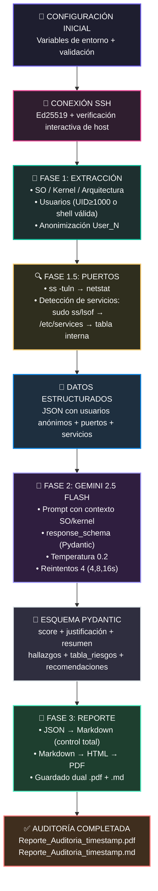

# 🛡️ Linux Security Auditor - CIS Benchmark Pipeline

[](https://www.python.org/downloads/)
[](https://deepmind.google/technologies/gemini/)

> **Pipeline automatizado de auditoría de seguridad para servidores Linux basado en estándares CIS Benchmarks, con análisis inteligente mediante Google Gemini AI, detección de servicios por puerto, y generación de reportes profesionales en PDF.**


---
## ✨ Características

### Core Features
- 🔐 **Conexión SSH segura** con verificación de huellas digitales (prevención MITM)
- 👤 **Anonimización automática** de usuarios (GDPR/LOPD compliant)
- 🔍 **Escaneo inteligente de puertos** con detección de servicios/procesos
- 🖥️ **Detección de sistema operativo** (distribución, versión, kernel, arquitectura)
- 🤖 **Análisis con IA** usando Google Gemini (Structured Outputs)
- 📊 **Score de seguridad** numérico (0-100) con justificación
- 📈 **Matriz de riesgos** con niveles de impacto (Crítico/Alto/Medio/Bajo)
- 🛠️ **Recomendaciones ejecutables** con comandos listos para copiar/pegar
- 📄 **Reportes profesionales** en PDF y Markdown
- 🔄 **Sistema de reintentos** con backoff exponencial para APIs

### Advanced Features
- 🎯 **Detección de servicios por puerto** usando múltiples estrategias:
  - `ss -lnp` con sudo (muestra proceso dueño)
  - `lsof -i` con sudo (alternativa)
  - `/etc/services` (diccionario estándar)
  - Tabla interna con +50 servicios conocidos
- 🧠 **Análisis contextual** que correlaciona:
  - Versiones de kernel con CVEs públicos
  - Servicios expuestos con cuentas de usuario
  - Puertos críticos con servicios de alto riesgo
- ⚡ **Detección de servicios prohibidos** (telnet, FTP, VNC, RDP, etc.)
---

---
## 📦 Requisitos Previos

- **Python 3.9 o superior**
- **Servidor Linux** objetivo (Ubuntu/Debian recomendado)
- **Acceso SSH** con llave privada (Ed25519 o RSA)
- **API Key de Google Gemini** (gratuita en [Google AI Studio](https://aistudio.google.com/))
- **Permisos de lectura** en el servidor para `/etc/passwd` y comandos de red
---

## Instalación

### 1. Clonar el repositorio
```bash
git clone https://github.com/p175624/Proyecto-IA-Auditor
cd Proyecto-IA-Auditor
```

### 2. Crear y activar el entorno virtual

Se recomienda usar un entorno virtual para aislar las dependencias del proyecto.

```bash
# Crear el entorno virtual
python3 -m venv venv

# Activar en macOS / Linux
source venv/bin/activate

# Activar en Windows (CMD)
venv\Scripts\activate.bat

# Activar en Windows (PowerShell)
venv\Scripts\Activate.ps1
```

Una vez activado, verás el prefijo `(venv)` en tu terminal:
```
(venv) usuario@equipo:~/pipeline-auditoria$
```

### 3. Instalar las dependencias
```bash
pip install -r requirements.txt
```

> Para desactivar el entorno virtual cuando termines: `deactivate`

---
## Configuración
Crea un archivo `.env` en la raíz del proyecto con las siguientes variables:
```env
# .env
GEMINI_API_KEY=tu_api_key_aqui
SSH_HOST=192.168.1.100
SSH_USER=tu_usuario
SSH_KEY_PATH=/home/user/.ssh/id_ed25519
SSH_KNOWN_HOSTS_PATH=/home/user/.ssh/known_hosts  # Opcional

# Opcional: Mejora la detección de servicios (permite ver procesos)
SUDO_PASSWORD=tu_contraseña_sudo
```
---
## Obtención de API Key de Gemini
Visita Google AI Studio

Inicia sesión con tu cuenta de Google

Haz clic en "Get API key"

Crea una nueva API key

Copia la clave en tu archivo .env
---

---
## Uso
```bash
python main.py
```

## Flujo de ejecución esperado
```bash
╔══════════════════════════════════════════════════════╗
║       🛡️  PIPELINE DE AUDITORÍA DE SEGURIDAD  🛡️       ║
║       Estándar: CIS — Con Salidas Estructuradas       ║
╚══════════════════════════════════════════════════════╝

  ✅  Variables de entorno verificadas correctamente.
  🔑  SUDO_PASSWORD detectado — detección de servicios con privilegios habilitada.

┌──────────────────────────────────────────────────────┐
│  📡  FASE 1 — Extracción de datos del servidor        │
└──────────────────────────────────────────────────────┘
  🔐  Conectando a 192.168.1.100 como 'admin'...
  ✅  Conexión SSH establecida exitosamente.
  🔍  Escaneando puertos en escucha...
  🔎  Identificando servicios en 12 puerto(s):
       TCP/22       → sshd
       TCP/80       → nginx
       TCP/443      → nginx
       TCP/3306     → mysqld
       TCP/5432     → postgres
       TCP/6379     → redis-server
       TCP/8080     → java
       TCP/8443     → apache2
       UDP/53       → systemd-resolve
       UDP/123      → chronyd
       UDP/161      → snmpd
       UDP/514      → rsyslogd
  📋  Puertos detectados: 12
  🖥️   Detectando sistema operativo y kernel...
  ✅  SO: Ubuntu 22.04.3 LTS | Kernel: 5.15.0-91-generic
  👤  Analizando cuentas de usuario (/etc/passwd)...
  👥  Usuarios relevantes encontrados: 8
  🔌  Conexión SSH cerrada.

┌──────────────────────────────────────────────────────┐
│  🤖  FASE 2 — Análisis Estructurado con IA           │
└──────────────────────────────────────────────────────┘
  ⏳  Enviando consulta a Gemini... (Intento 1/4)
  ✅  ¡Datos estructurados JSON devueltos por la IA correctamente!

┌──────────────────────────────────────────────────────┐
│  📄  FASE 3 — Generación del Reporte PDF              │
└──────────────────────────────────────────────────────┘
  ⚙️   Parseando JSON estructurado y construyendo HTML estable...
  📑  Reporte PDF Estabilizado → Reporte_Auditoria_20260112_143022.pdf
  📝  Reporte Markdown Guardado → Reporte_Auditoria_20260112_143022.md

╔══════════════════════════════════════════════════════╗
║          ✅  AUDITORÍA COMPLETADA CON ÉXITO           ║
╚══════════════════════════════════════════════════════╝
```

Al finalizar, encontrarás en el directorio de trabajo:
```
Reporte_Auditoria_YYYYMMDD_HHMMSS.pdf
Reporte_Auditoria_YYYYMMDD_HHMMSS.md
```
---
## Seguridad

✅ Verificación de host SSH (previene MITM attacks)

✅ Anonimización de datos antes del análisis externo

✅ Sin almacenamiento de credenciales en código

✅ Variables de entorno para datos sensibles

✅ Conexiones SSH con llaves (no contraseñas)

✅ Timeout configurable en conexiones

✅ Múltiples estrategias de detección con fallback

✅ Soporte opcional de sudo (no requiere permisos excesivos)

---
